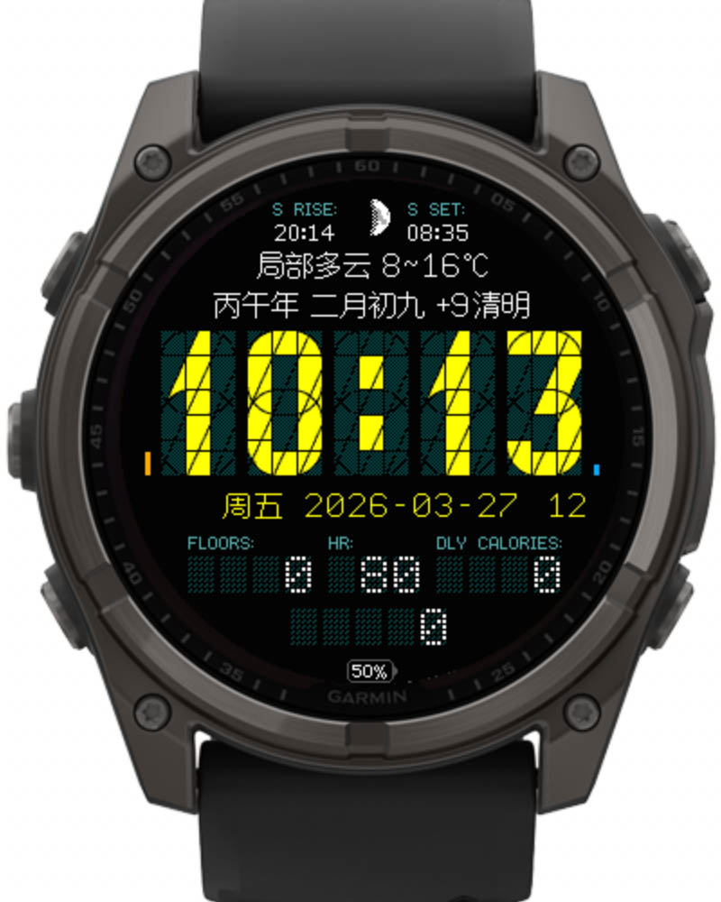

# Seg34Lite.CN
修改自Segment34 MkII表盘([https://github.com/ludw/Segment34mkII](https://github.com/ludw/Segment34mkII))，感谢原作者开源！添加了农历和二十四节气显示，顺便对设置菜单和天气也做了汉化，并精简了很多功能，以适配运行内存比较紧张的老款设备。

## 更新日志 
2026年4月2日 v1.2版：  
1.进一步优化农历模块以节省运行内存；  
2.修复了有些设备上电量条形图显示异常的问题。  

2026年4月1日 v1.1版：  
1.给身体压力值增加了缓存，解决了压力有时候不显示的问题；  
2.调整了语言顺序，解决某些手机上设置页面不显示中文的问题；  
3.恢复了之前被精简掉的下一个太阳事件功能。

2026年3月28日 v1.0版：  
基于Segment34 MkII 4.6.2版精简汉化，适配F6S、F6SP、245、945等型号。  